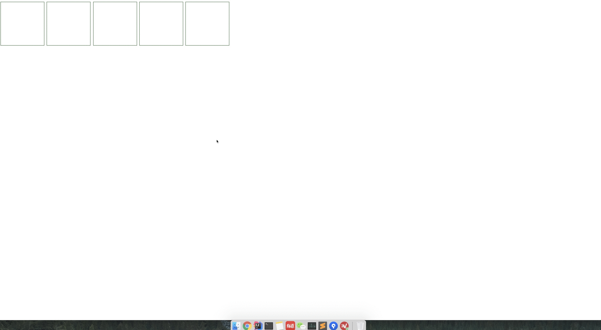

## example 



## 用法

```
$(function () {
        // 创建实例
        var cube = $('#container').cube();

        // 开启
        $('.pool').click(function () {
            cube.open(this);
        });

        // 关闭
        $('#closeBtn').click(function () {
            cube.close()
        });
    });
```